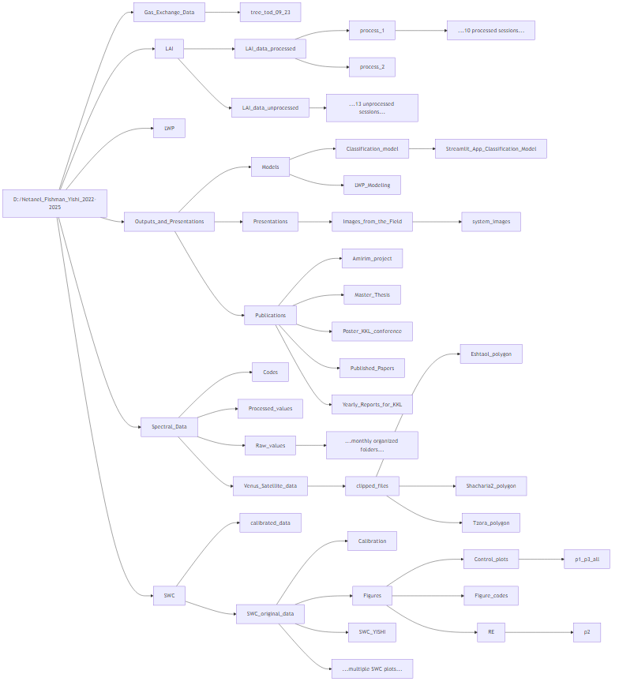

# Yishi Project Archive

This folder contains the data and code collected and developed during the **Yishi Project**.  
The project aimed to model **Leaf Water Potential (LWP)** in a mixed Mediterranean forest, detect drought effects, and predict these effects at the plot level using **remote sensing tools**.

For more details about the project, please refer to the papers available in the [`Outputs_and_Presentation`](/Outputs_and_Presentations/Publications/Published_Papers) folder.

**Author:** Netanel Fishman  
**Affiliation:** David Helman Lab, the Faculty of Agriculture, Food & Environment, Hebrew University of Jerusalem  
**Contact:** netanel.fishman@mail.huji.ac.il  
**Last updated:** July 2025

---

## Note

In this archive you can find all the important files used for this research. 
more files, drafts and MISC could be found in Netanel's Google Drive on:

https://drive.google.com/drive/folders/1INSyQPevl2BiFTFHdwgIJc3rtam6Pwbq?usp=drive_link
This folder is less orgenized than the archive, but you could find there extra information.
The Data in "amirim" folder is more earlier in the research, while later it was re-orgenized into the "Thesis" folder. Some of the files in "Theis" are just shortcuts to the files in "amirim" folder.

Another Google Drive folder that could be useful is Yehuda Youngstein's folder. Yehuda was involved in the modeling process and most of the work of the models was done in his folder.
Here is the link:
https://drive.google.com/drive/folders/1GLuUrCAOM4DvvgzyZRaGN0ip2bYLmr3Z?usp=sharing

---

## 📁 Folder Structure

The directory is organized by data type:

- `Spectral data`
- `LWP measurements`
- `LAI (Leaf Area Index)`
- `Gas exchange data`
- `SWC (Soil Water Content)`
- `Outputs and presentation` – project results and public materials

---

## 📦 Contents of Each Folder

Inside each subfolder, you will typically find:

- `Raw data`
- `Processed data`
- `Python scripts` used for data processing and visualization

---

## ⚠️ Note on Spectral Data

As mentioned in the README file of the **Spectral Data** folder:  
Raw imagery acquired by **drone** and the **VENµS satellite** is **not included** here due to large file sizes.  
These datasets are stored on the **Givat Ram cloud server**.

👉 For access details, please refer to the [Spectral Data README](/Spectral_Data/README.md).

---

## Here you can find the Archive foldera structure:

